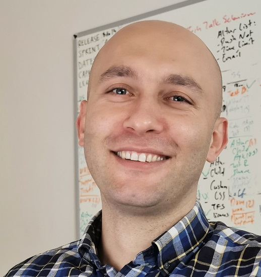

In this episode, I talk to Alper Kemal Koç, who was the first engineer building a low code platform called [Kuika](https://www.kuika.com/), that helps users develop mobile applications. Alper shares with me how he build this startup from idea to serving over 15 customers, and which cultural differences he observed when building software in Turkey, the Netherlands and the rest of the world.

**We talk about:**

- why and how he joined this startup,
- how he decided on the right tech stack,
- how customer feedback influenced their direction,
- which engineering practices he values at this startup,
- and which relationship they have with their investors.

### Subscribe on [iTunes](https://podcasts.apple.com/at/podcast/software-engineering-unlocked/id1477527378?l=en), [Spotify](https://open.spotify.com/show/2wz1OneBIDXpbBYeuyIsJL?si=2I0R0HuaTLK6RT0f7lDIFg), [Google](https://www.google.com/podcasts?feed=aHR0cHM6Ly9mZWVkcy5zaW1wbGVjYXN0LmNvbS9LMV9tdjBDSg%3D%3D), [Deezer](https://www.deezer.com/show/465682), or via [RSS](https://www.software-engineering-unlocked.com/subscribe/).

<iframe frameborder="no" height="200px" scrolling="no" seamless="" src="https://player.simplecast.com/ed21c78c-d730-4143-9d78-ec4679786d9c?dark=false" width="100%"></iframe>

**Links:**

[Alper’s Twitter account](https://twitter.com/alperkemalkoc)

[Kuika](https://www.kuika.com/) the startup they are building

**Show notes:**

Alper starts by explaining to me why and how he joined this startup. (0:50)

How did they find a business opportunity? (2:07)

How did he choose the right technologies for building this idea? (3:02)

Alper explains to me that he first build the apps they want to build, and then, they build the software that can generate the apps they first build (4:27)

Did the technology they used or the solution they built change over time? (4:52)

What are the engineering methodologies they use at a startup and did that mature over time? (7:08)

– Alper explains to me that they developed and still evolve their methodology in an iterative process.

– They tried all kind of processes and methodologies and always reflected on how it fits their current need.

Alper mentions that how they do things in Turkey is different than how people do things in the Netherlands. Of course, I want to learn more about that (10:06)

Has testing been a part of their software engineering process from the beginning on?

– Well, it has been tricky, Alper says. And it evolved over time. But finally they came up with a great tool that helps them to detect regressions and saves them a lot of time. (11:55)

And do they do code reviews? (14:48)

Are they still doing retrospectives and changing things as rigorously as at the beginning? (16:42)

Alper explains how they always strive to make the processes and practices enjoyable and beneficial for every team member. (18:16)

Alper says that one of the most important thing a engineer does is to say that he can’t do something. That way, the whole team can find a solution. (20:00)

At his startup, engineers are allowed to work 20% of their time on something that interests them. One of his employees decided to build a wedding invitation app. Alper says, this is just such an valuable experiment, because this employee knows exactly how is is to be in the customer shoes. (22:00)

You want to listen to feedback from customers or lead, but at the same time you have to be careful that it isn’t misleading, Alper says. (25:16)

Alper learns every day at the startup, but most of the technologies they knew from previous experiences. (29:36)

So, how did Alper get the first customer? From their personal network, he explains. (37:22)

Alper also talks about their investors and their relationships. In fact, they are very involved in the company. (38:23)

Did they have troubles hiring for their startup and how did they overcome those challenges? (41:45)
