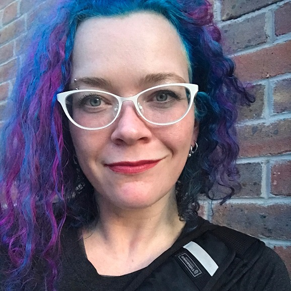

In this episode, I talk to Charity Majors, founder, and CTO of honeycomb. Honeycomb is a tool for introspecting and interrogating your production systems. It represents the new generation of monitoring systems that can handle highly distributed and complex systems. Charity shares with me what observability means and how we can make systems more reliable and maintainable.

**We talk about:**

- the new generation of DevOps,
- how and why we should assess systems in production,
- the flaws of staging areas,
- what it takes to make on-call a good experience,
- how to assess engineering excellence,
- and how and why she founded honeycomb.

### Subscribe on [iTunes](https://podcasts.apple.com/at/podcast/software-engineering-unlocked/id1477527378?l=en), [Spotify](https://open.spotify.com/show/2wz1OneBIDXpbBYeuyIsJL?si=2I0R0HuaTLK6RT0f7lDIFg), [Google](https://www.google.com/podcasts?feed=aHR0cHM6Ly9mZWVkcy5zaW1wbGVjYXN0LmNvbS9LMV9tdjBDSg%3D%3D), [Deezer](https://www.deezer.com/show/465682), or via [RSS](https://www.software-engineering-unlocked.com/subscribe/).

**Links:**

- [Honeycomb](https://www.honeycomb.io/)
- [Charity’s website](https://charity.wtf/)
- [Christine Yen](https://twitter.com/cyen): Co-founder of honeycomb
- Post on [engineering management: the pendulum or the ladder](https://charity.wtf/2019/01/04/engineering-management-the-pendulum-or-the-ladder/)
- [Paper about Scuba](https://research.fb.com/wp-content/uploads/2016/11/scuba-diving-into-data-at-facebook.pdf) – Facebook’s Scuba data management system for real-time analysis

**Show notes:**

We start of by Charity explaining why she founded honeycomb. It all happened during her time at Facebook. She actually thought she will – after leaving Facebook – go on to be an engineering manager. But when she thought about how to engineer systems without all the tools and systems they had at Facebook, she realized that there is a big gap in the market.

At Facebook, she relied heavily on a tool called Scuba. Scuba is Facebook’s data management system to analyze and understand real-time data. Well, turns-out, outside of Facebook such great tools aren’t available, or are not affordable. And because investors literally knocked at her door to fund her – after leaving Facebook – Charity took this chance and started honeycomb.

In the early beginnings they literally just had three slides, an understanding of a problem (debugging and troubleshooting highly complex systems), and the desire to make an impact.

Over the next year, Charity and her co-founder Christine Yen went all heads-down and figure out what exactly they want to build and how to talk about it.

It was a long and painful process, but at one point they decided that the term observability is what describes best what they have in mind. (6:30)

Charity explains that through observing the output of a system an engineer can actually infer what is going on internally. So, finally they knew themselves what they want to build and how to talk about it: they tried to build a system they let’s you understand any state the system has gotten itself into, even if you have never seen this state before.

And such systems can have a big impact on people’s life – especially for Site Reliability Engineers, DevOps, and Developers. Charity and I talk about how to make on-call experiences better, and how developers are nowadays more and more needed in the operations phase of a system. (7:40)

Because even though we have Q&amp;A departments, manual testers, dedicated operations peoples, Charity explains that also the engineers have to spend their time operating the systems. She says that nowadays there is no way to build reliable and maintainable systems, if the developers do not spend time actually understanding and analysing how the system behaves in production.

She also explains why staging areas are a bad idea, and how those falsified environments just contribute to us learning the wrong signals, and destroying our ability to make good judgments about the behavior of the system when actual in production. (15:00)

Charity also tells me that she thinks almost every developer should try out management at least for some time. She says that this experience gives engineers a new perspective and many valuable skills that make them better engineers, even when they go back to engineering. (25:07)

Later Charity fills me in on their tech stack, and also explains why code reviews and communication are valued so highly at their company. (29:35)

Charity is a big believer of transparency and openness when it comes to sharing incident reports (33:37). Sharing revenue numbers on the other hand isn’t something that’s common in her market, and so, it would be a competitive disadvantage, she says (35:19).

In the last bit of the interview, Charity shares with me how she found her first investors, and how they feel much more stable, secure and on the right track with this second round of funding. Well, I really enjoyed talking to and learning from Charity and really admire her openness. Thank you Charity for being on my show.
